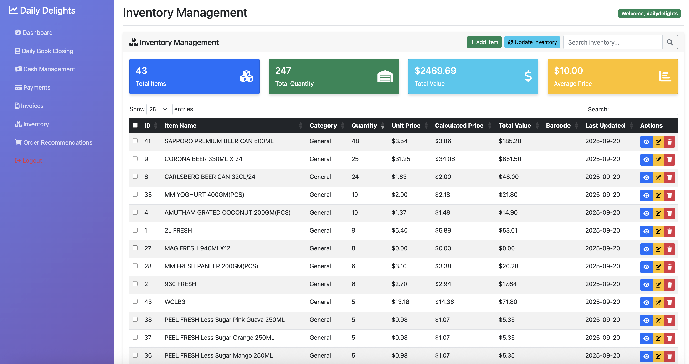

# Sentinel - Smart Convenience Store Management System


## 📋 Table of Contents
- [What is Sentinel?](#what-is-sentinel)
- [Understanding Convenience Store Operations](#understanding-convenience-store-operations)
- [Key Features](#key-features)
- [System Architecture](#system-architecture)
- [Installation & Setup](#installation--setup)
- [Usage Guide](#usage-guide)
- [API Documentation](#api-documentation)
- [Contributing](#contributing)
- [License](#license)

## 🏪 What is Sentinel?

Sentinel is a comprehensive **AI-powered inventory and operations management system** designed specifically for convenience stores and small retail businesses. Originally developed for **Daily Delights**, a convenience store in Singapore, this system automates the complex daily tasks that store owners face, from tracking inventory to processing payments and generating intelligent restocking recommendations.

Think of it as your **digital store assistant** that works 24/7 to keep your business running smoothly!

## 🛒 Understanding Convenience Store Operations

### The Daily Challenges Store Owners Face:

**1. Inventory Management** 🗃️
- Tracking hundreds of products manually
- Knowing when to reorder items before running out
- Managing supplier relationships and delivery schedules
- Calculating profit margins on each product

**2. Financial Tracking** 💰
- Recording daily sales from multiple payment methods (cash, card, mobile payments)
- Tracking supplier invoices and payment due dates
- Reconciling daily cash register totals
- Managing accounts payable to suppliers

**3. Daily Operations** 📊
- Processing customer transactions
- Updating inventory after deliveries
- Analyzing sales patterns to optimize stock
- Handling payment processing across different methods

### How Traditional Stores Operate:
1. **Morning**: Count cash, check inventory levels
2. **Throughout Day**: Serve customers, receive deliveries, update stock manually
3. **Evening**: Count cash register, record sales, note items running low
4. **Weekly**: Review what needs to be ordered, process supplier payments

### How Sentinel Transforms This:
- **Automated inventory tracking** with AI-powered reorder suggestions
- **Digital invoice processing** that extracts data from photos
- **Smart payment management** with automated due date tracking
- **Real-time sales analytics** and profit monitoring
- **Telegram bot integration** for mobile operations

## ✨ Key Features

### 🤖 AI-Powered Inventory Intelligence
- **Smart Reorder Recommendations**: AI analyzes sales patterns to suggest optimal reorder quantities and timing
- **Supplier Relationship Management**: Track delivery schedules and payment terms for each supplier
- **Automated Stock Alerts**: Get notified when items are running low
- **Profit Optimization**: Calculate best-selling items and profit margins

### 📱 Mobile-First Operations
- **Telegram Bot Integration**: Upload invoices and daily closing reports via mobile
- **Photo-to-Data Processing**: AI extracts invoice details from photos automatically
- **Remote Monitoring**: Check store status from anywhere

### 💼 Financial Management
- **Multi-Payment Tracking**: Handle cash, NETS (Singapore's payment system), credit cards, and QR payments
- **Daily Book Closing**: Automated reconciliation of daily sales across all payment methods
- **Supplier Payment Tracking**: Monitor invoice due dates and payment status
- **Financial Analytics**: Understand cash flow and profitability trends

### 📊 Business Intelligence Dashboard
- **Real-time Analytics**: Track sales, inventory levels, and financial health
- **Interactive Reports**: Visual charts and graphs for easy understanding
- **Historical Trends**: Analyze performance over time
- **Export Capabilities**: Generate reports for accounting or analysis

## 🏗️ System Architecture

```
┌─────────────────┐    ┌─────────────────┐    ┌─────────────────┐
│   Telegram Bot  │    │   Web Dashboard │    │  Google Drive   │
│   (Mobile UI)   │    │   (Admin UI)    │    │   (Storage)     │
└─────────┬───────┘    └─────────┬───────┘    └─────────┬───────┘
          │                      │                      │
          │                      │                      │
          └──────────────────────┼──────────────────────┘
                                 │
                    ┌─────────────▼─────────────┐
                    │      Flask Backend       │
                    │   (Core Application)     │
                    └─────────────┬─────────────┘
                                  │
                    ┌─────────────▼─────────────┐
                    │      SQLite Database     │
                    │   (Data Storage)         │
                    └───────────────────────────┘
```

### Core Components:

1. **Flask Web Application** (`app.py`)
   - Main dashboard for store management
   - RESTful API endpoints for data operations
   - User authentication and session management

2. **AI Recommendation Engine** (`orderRecommendations/`)
   - Analyzes sales patterns and inventory levels
   - Generates intelligent reorder suggestions
   - Optimizes supplier ordering schedules

3. **Telegram Bot** (`telegramBot.py`)
   - Mobile interface for quick operations
   - Photo upload for invoices and daily reports
   - Google Drive integration for document storage

4. **Data Processing Modules**
   - **Invoice Processing**: AI-powered data extraction from photos
   - **Sales Analysis**: Pattern recognition and trend analysis
   - **Payment Integration**: UOB bank email processing for automated payment tracking

## 🚀 Installation & Setup

### Prerequisites
- Python 3.8 or higher
- Gmail account for Google Drive integration
- Telegram Bot Token (for mobile features)
- Basic understanding of command line operations

### Step 1: Clone the Repository
```bash
git clone https://github.com/yourusername/sentinel.git
cd sentinel
```

### Step 2: Install Dependencies
```bash
pip install -r requirements.txt
```

### Step 3: Environment Configuration
Create a `.env` file in the root directory:
```env
# Telegram Bot Configuration
BOT_TOKEN=your_telegram_bot_token_here

# Google Drive API (Optional - for document storage)
GOOGLE_DRIVE_FOLDER_ID=your_folder_id

# Together AI API (Optional - for advanced AI features)
TOGETHER_API_KEY=your_together_api_key
```

### Step 4: Database Setup
```bash
# Initialize the database
python3 create_product_table.py
```

### Step 5: Start the Application
```bash
# Start the web application
python3 app.py

# In a separate terminal, start the Telegram bot (optional)
python3 telegramBot.py
```

### Step 6: Access the Dashboard
Open your web browser and navigate to: `http://localhost:5000`

## 📖 Usage Guide

### For Store Owners (Getting Started):

#### 1. Setting Up Your Store 🏪
1. **Login** to the web dashboard
2. **Add Your Products**: Go to Inventory → Add items with names, categories, and prices
3. **Configure Suppliers**: Add supplier information in the Payments section
4. **Initial Inventory Count**: Set current stock levels for all products

#### 2. Daily Operations 📅

**Morning Routine:**
1. Check the **Dashboard** for overnight insights
2. Review **Order Recommendations** for today's deliveries
3. Use **Telegram Bot** to upload any new invoices received

**During the Day:**
- Customers make purchases (external POS system handles transactions)
- Receive supplier deliveries
- Upload **Invoice Photos** via Telegram bot

**Evening Routine:**
1. Upload **Daily Closing Report** via Telegram bot
2. Review **Daily Book Closing** page to reconcile payment methods
3. Check **Inventory Levels** and note any discrepancies

#### 3. Weekly Management 📈
1. **Review Analytics**: Check sales trends and profit margins
2. **Process Payments**: Review supplier invoices due for payment
3. **Plan Orders**: Use AI recommendations to plan next week's orders
4. **Inventory Audit**: Compare system inventory with physical count

### Key Workflows:

#### Invoice Processing Workflow 📄
1. **Receive Invoice** from supplier (physical or digital)
2. **Take Photo** of invoice using phone
3. **Send to Telegram Bot** using `/upload_invoices` command
4. **AI Extracts Data** automatically (supplier, items, quantities, prices)
5. **Review and Confirm** data in web dashboard
6. **Update Inventory** levels automatically

#### Daily Closing Workflow 🔐
1. **Count Cash Register** at end of day
2. **Take Photo** of daily sales report from POS system
3. **Send to Telegram Bot** using `/upload_dailybookclosing` command
4. **System Processes** payment method breakdowns
5. **Reconcile Amounts** in Daily Book Closing page
6. **Generate Insights** for next day operations

### Understanding the Dashboard:

#### 📊 **Dashboard Page**
- **Sales Overview**: Today's revenue across all payment methods
- **Low Stock Alerts**: Items that need immediate attention
- **Payment Reminders**: Supplier invoices due soon
- **Quick Actions**: Fast access to common tasks

#### 🗃️ **Inventory Page**
- **Product Catalog**: All items with current stock levels
- **Stock Movements**: Track deliveries and sales
- **Price Management**: Update costs and selling prices
- **Barcode Support**: Link products to barcode scanning

#### 📄 **Invoices Page**
- **Supplier Invoices**: All received invoices with status
- **Payment Tracking**: Due dates and payment history
- **Data Extraction**: AI-processed invoice details
- **Search and Filter**: Find specific invoices quickly

#### 💰 **Payments Page**
- **Outstanding Payments**: Invoices waiting for payment
- **Payment History**: Record of all supplier payments
- **Due Date Management**: Automated reminders and alerts
- **Payment Method Tracking**: Cash, bank transfer, check records

#### 📊 **Daily Book Closing Page**
- **Daily Sales Summary**: Revenue breakdown by payment method
- **Cash Reconciliation**: Compare POS totals with actual cash
- **Payment Method Analysis**: NETS, credit, cash breakdowns
- **Historical Trends**: Compare with previous days/weeks

#### 🤖 **Order Recommendations Page**
- **AI Suggestions**: Smart reorder recommendations
- **Supplier Schedules**: Optimal ordering calendar
- **Stock Predictions**: Forecasted inventory needs
- **Cost Optimization**: Best value ordering strategies

## 🔌 API Documentation

### Authentication
All API endpoints require session-based authentication through the web interface.

### Core Endpoints

#### Inventory Management
```http
GET /api/inventory
POST /api/inventory/add
PUT /api/inventory/edit/{id}
DELETE /api/inventory/delete/{id}
```

#### Invoice Processing
```http
GET /api/invoices
POST /api/invoices/add
GET /api/invoices/search?q={query}
```

#### Payment Tracking
```http
GET /api/payments
POST /api/payments/add
PUT /api/payments/edit/{id}
```

#### Daily Book Closing
```http
GET /api/daily-book-closing
POST /api/daily-book-closing/add
```

#### AI Recommendations
```http
GET /api/order-recommendations?date={YYYY-MM-DD}
GET /api/order-recommendations/14-day-schedule?start_date={YYYY-MM-DD}
```

### Telegram Bot Commands
```
/start - Initialize the bot
/upload_invoices - Upload supplier invoice photos
/upload_dailybookclosing - Upload daily sales reports
/help - Show available commands
```

## 🤝 Contributing

We welcome contributions from developers interested in retail technology and AI applications!

### Development Setup
1. Fork the repository
2. Create a feature branch (`git checkout -b feature/amazing-feature`)
3. Make your changes
4. Add tests if applicable
5. Commit your changes (`git commit -m 'Add some amazing feature'`)
6. Push to the branch (`git push origin feature/amazing-feature`)
7. Open a Pull Request

### Areas for Contribution
- **AI/ML Improvements**: Enhance recommendation algorithms
- **Mobile App Development**: Native iOS/Android apps
- **Payment Integrations**: Additional payment gateway support
- **Reporting Features**: Advanced analytics and insights
- **Multi-language Support**: Internationalization
- **Performance Optimization**: Database and API improvements

## 📊 Technology Stack

- **Backend**: Python Flask, SQLAlchemy
- **Database**: SQLite (easily upgradeable to PostgreSQL/MySQL)
- **Frontend**: HTML, CSS, JavaScript, Bootstrap, DataTables
- **AI/ML**: Pandas, NumPy for data analysis
- **Mobile Interface**: Telegram Bot API
- **Cloud Storage**: Google Drive API
- **Authentication**: Google OAuth2
- **Data Processing**: Pydantic for validation, PIL for image processing

## 🔒 Security Considerations

- All sensitive data is stored locally in SQLite database
- Google Drive integration uses OAuth2 for secure authentication
- Telegram bot requires token-based authentication
- Session-based authentication for web interface
- No credit card or sensitive financial data stored

## 📈 Future Roadmap

### Short Term (Next 3 Months)
- [ ] **Barcode Scanning Integration**: Mobile barcode scanning for inventory
- [ ] **Advanced Analytics**: Sales forecasting and trend analysis
- [ ] **Multi-store Support**: Manage multiple store locations
- [ ] **Automated Reporting**: Email/SMS daily/weekly reports

### Medium Term (6 Months)
- [ ] **Mobile Apps**: Native iOS and Android applications
- [ ] **Advanced AI**: Machine learning for demand prediction
- [ ] **Supplier Integration**: Direct API connections with suppliers
- [ ] **Customer Analytics**: Track customer purchase patterns

### Long Term (1 Year+)
- [ ] **Franchise Management**: Multi-location dashboard
- [ ] **E-commerce Integration**: Online store management
- [ ] **Advanced Financial Analytics**: Profit optimization tools
- [ ] **Industry Integrations**: POS system partnerships

## 📞 Support & Community

### Getting Help
- **Documentation**: Comprehensive guides in `/docs` folder
- **Issues**: Report bugs and request features via GitHub Issues
- **Discussions**: Join community discussions in GitHub Discussions
- **Email**: Contact maintainers at sgdailydelights@gmail.com

### Community
- **Discord**: Join our developer community
- **Newsletter**: Get updates on new features and releases
- **Blog**: Read case studies and implementation guides

## 📄 License

This project is licensed under the MIT License - see the [LICENSE](LICENSE) file for details.

## 🙏 Acknowledgments

- **OpenAI** for GPT-based text processing capabilities
- **Google** for Drive API and authentication services
- **Telegram** for bot platform and mobile integration
- **Flask Community** for the excellent web framework
- **Bootstrap** for responsive UI components

---

**Made with ❤️ for small business owners who deserve powerful, affordable technology.**

> "Empowering every convenience store with AI-driven insights and automation."
> *Originally developed for Daily Delights convenience store, Singapore*

---

## 📸 Screenshots

### Dashboard Overview

*Real-time overview of store operations with key metrics and alerts*

### Inventory Management

*Comprehensive product catalog with stock levels and pricing*

### AI Recommendations

*Smart reorder suggestions based on sales patterns and inventory levels*

### Mobile Interface (Telegram Bot)

*Easy mobile access for invoice uploads and daily operations*

---

**⭐ If this project helps your business, please consider giving it a star!**